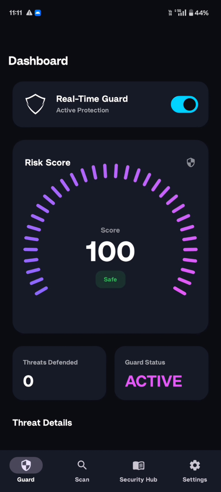
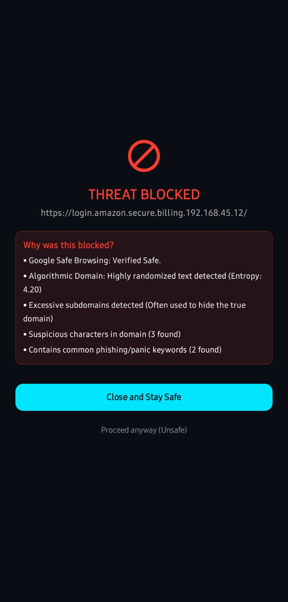

<div align="center">


# Anzen

**Enterprise-Grade Phishing Defense & Intent Firewall for Android**

[](https://anzen.pages.dev)
[](https://github.com/MR-05-001/ANZEN/releases/tag/v1.0.0)
[](https://kotlinlang.org)
[](https://developer.android.com/jetpack/compose)
[](https://opensource.org/licenses/MIT)

*Zero-knowledge. Real-time. Fully on-device.*

Anzen is a real-time security engine for Android that intercepts zero-day phishing links, calculates domain entropy, strips invisible trackers, and blocks malicious sites in milliseconds — all running 100% locally on your device.

[**Download APK**](https://github.com/MR-05-001/ANZEN/releases/tag/v1.0.0) · [**Official Website**](https://anzen.pages.dev) · [**Report a Bug**](https://github.com/MR-05-001/ANZEN/issues)

</div>

---

## 📱 Screenshots

| Real-Time Dashboard | Deep Scanner | Threat Interception |
|:---:|:---:|:---:|
|  |  |  |

---

## 🚀 Why Anzen?

Traditional mobile antiviruses rely on slow cloud blacklists that routinely miss newly generated "zero-day" phishing links. Attackers actively bypass them using **Domain Generation Algorithms (DGA)** and **Homograph attacks** — techniques that are invisible to signature-based scanners.

Anzen takes a fundamentally different approach: it analyzes the mathematical *DNA* of a link the moment you tap it, using a dual-layer interception net that hooks directly into the Android OS — no cloud round-trip required.

---

## ✨ Core Features

| Feature | Description |
|---|---|
| 🌐 **Omnipresent Interception** | Custom Intent Firewall + `AccessibilityService` scans links across SMS, WhatsApp, and the top 6 Android browsers *before* they open |
| 🔢 **Mathematical Heuristics** | Shannon Entropy detection for DGA burner domains; Punycode/Homograph analysis for brand-spoofing attacks |
| 🧹 **Privacy Purge** | Silently strips marketing and analytics trackers (`fbclid`, `utm_source`, etc.) from safe links before browser handoff |
| 🔒 **Zero-Knowledge Architecture** | 100% local processing — no keystroke logging, no browsing history leaving your device |
| 📊 **Dynamic Telemetry UI** | Jetpack Compose dashboard with custom Canvas graphics for real-time risk scoring and threat history |

---

## 🧠 The Heuristics Engine

When a URL is intercepted, it passes through a 4-stage analysis pipeline entirely on-device:

```
      URL Intercepted
             │
             ▼
┌─────────────────────────────┐
│  Stage 1: Extraction &      │  Regex-based deep extraction strips obfuscation
│  Sanitization               │  and uncovers cloaked links inside text blocks
└────────────┬────────────────┘
             │
             ▼
┌─────────────────────────────┐
│  Stage 2: Punycode /        │  IDN.toASCII() conversion detects Cyrillic/Greek
│  Homograph Analysis         │  spoofing of trusted brands (аpple.com ≠ apple.com)
└────────────┬────────────────┘
             │
             ▼
┌─────────────────────────────┐
│  Stage 3: Shannon Entropy   │  Measures domain randomness — human-readable
│  Calculation                │  domains score low; DGA domains trigger alerts
└────────────┬────────────────┘
             │
             ▼
┌─────────────────────────────┐
│  Stage 4: Deep Spoofing &   │  Detects hijacked brand names in URL paths and
│  Tunnel Detection           │  flags Ngrok/Cloudflare tunnels used in Zphisher
└─────────────────────────────┘
```

---

## 🛠️ Tech Stack

| Layer | Technology |
|---|---|
| **Language** | [Kotlin 1.9+](https://kotlinlang.org/) |
| **UI** | [Jetpack Compose](https://developer.android.com/jetpack/compose) + custom `Canvas` |
| **Architecture** | MVVM + Clean Architecture |
| **Dependency Injection** | [Dagger-Hilt](https://dagger.dev/hilt/) |
| **Async** | Kotlin Coroutines & Flow |
| **Local Storage** | [Room](https://developer.android.com/training/data-storage/room) (SQLite) |

---

## 🔒 OS Compliance & Permissions

Anzen is built with strict compliance with **Google Play Protect** guidelines. Deep OS access is required for interception; here's how we handle it responsibly:

- ✅ Explicit Prominent Disclosure UI before requesting `AccessibilityService`
- ✅ Proper `android:description` XML tags for full OS-level transparency
- ✅ Events strictly limited to `typeViewClicked` and `typeWindowContentChanged` to minimize battery impact and preserve privacy

---

## 📥 Installation

### Option A — Direct APK

1. Download `app-release.apk` from [GitHub Releases](https://github.com/MR-05-001/ANZEN/releases/tag/v1.0.0)
2. On your device, allow your browser or file manager to **Install unknown apps**
3. Open the APK, install Anzen, and follow the secure onboarding flow

### Option B — Build from Source

**Prerequisites**
- Android Studio Iguana or newer
- Min SDK: **API 26** (Android 8.0 Oreo)
- Target SDK: **API 34** (Android 14)

---

## 🤝 Contributing

Contributions, issues, and feature requests are welcome. Please open an [issue](https://github.com/MR-05-001/ANZEN/issues) first to discuss what you'd like to change.

---

## 📄 License

Distributed under the MIT License. See [`LICENSE`](LICENSE) for details.

---

<div align="center">
  <sub>Built with ❤️ for a safer mobile web · <a href="https://anzen.pages.dev">anzen.pages.dev</a></sub>
</div>
